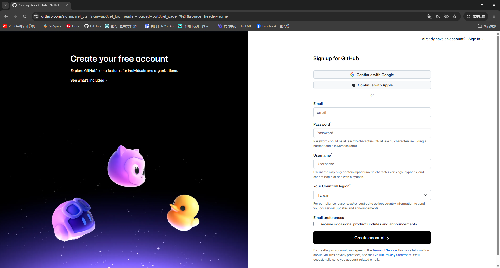
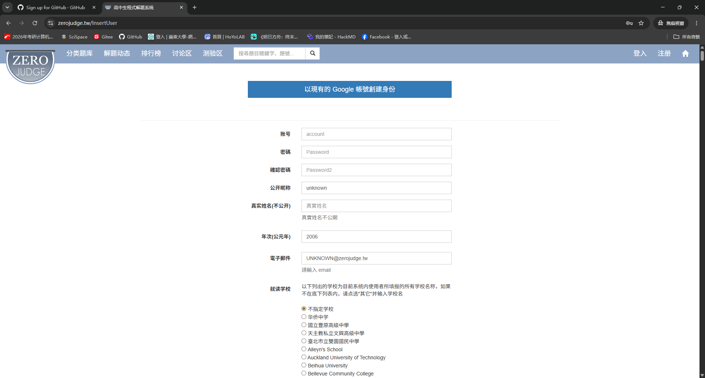
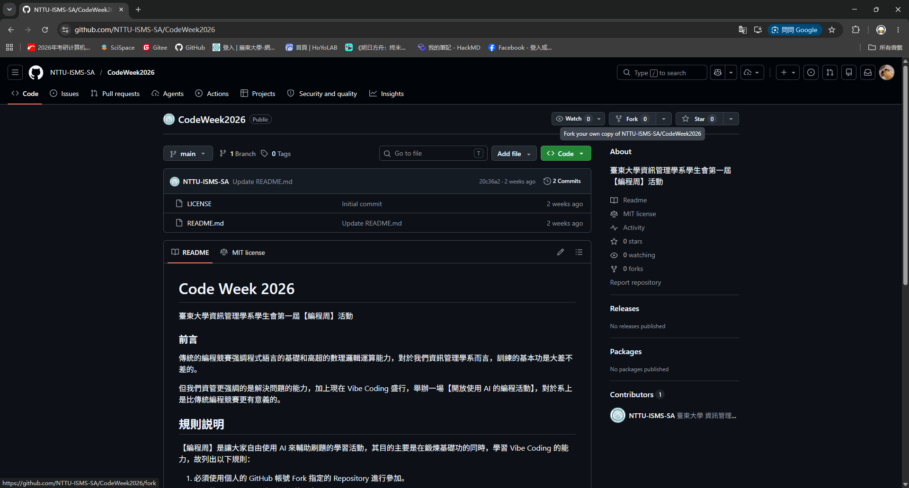
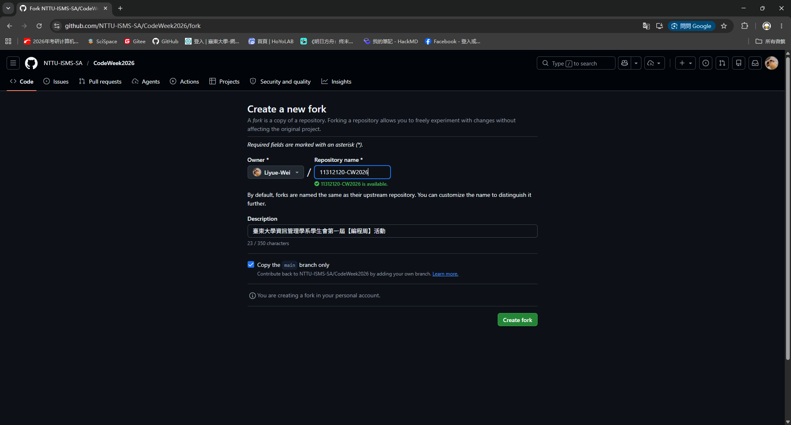
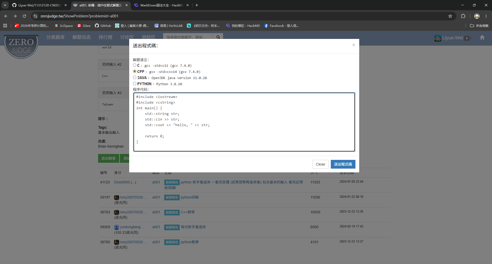
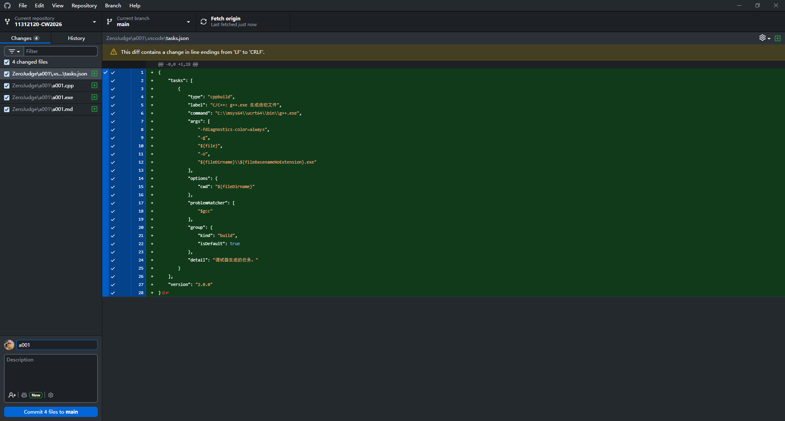
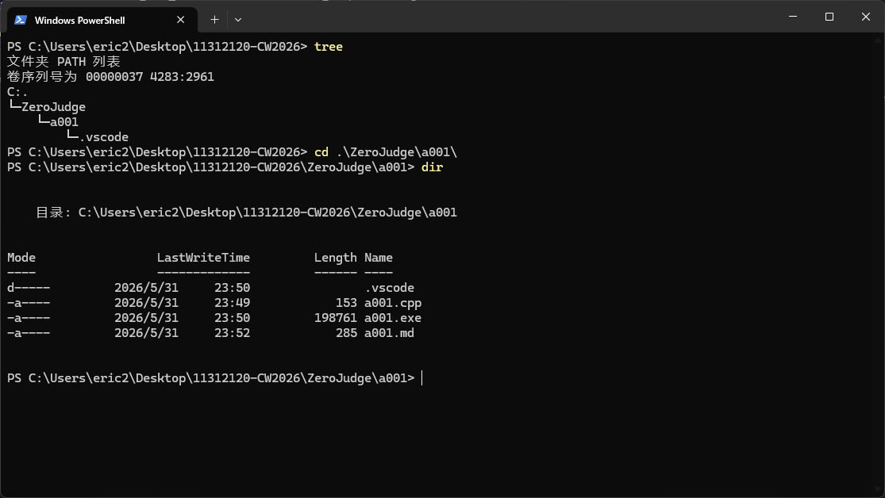
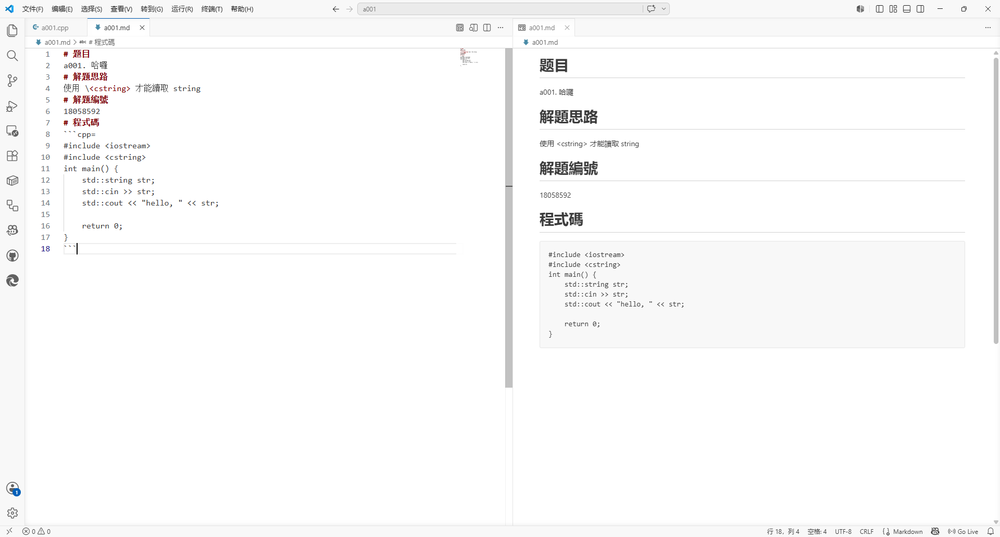

# Code Week 2026
臺東大學資訊管理學系學生會第一屆【編程周】活動

### 前言
傳統的編程競賽强調程式語言的基礎和高超的數理邏輯運算能力，對於我們資訊管理學系而言，訓練的基本功是大差不差的。

但我們資管更强調的是解決問題的能力，加上現在 Vibe Coding 盛行，舉辦一場【開放使用 AI 的編程活動】，對於系上是比傳統編程競賽更有意義的。

## 規則説明
【編程周】是讓大家自由使用 AI 來輔助刷題的學習活動，其目的主要是在鍛煉基礎功的同時，學習 Vibe Coding 的能力，故列出以下規則：

1. 必須使用個人的 GitHub 帳號 Fork 指定的 Repository 進行參加。
2. 必須使用 ZeroJudge 作爲刷題的平臺，題目不限。
3. 必須**嚴格按照範例**進行學習筆記的記錄，未作記錄的題目不列入計算。
4. 全程開放使用 AI 工具進行輔助。
5. 自活動開始至活動截止，依照**符合規定**之【題數】進行計分，每題加權相同。

## 活動限制
限臺東大學資管系在校學生參賽，限制50人參加

## 範例教學
1. 注冊 GitHub 賬號

2. 注冊 ZeroJudge 賬號

3. fork 本次活動的 GitHub Repo

4. 命名爲【學號-CW2026】

5. 在 ZeroJudge 進行刷題

6. commit 内容為【題號】

7. **嚴格按照以下結構進行題目分組，未符合者不予計分**

8. **嚴格按照以下格式進行題目記錄，未符合者不予計分**

## 獎品
### 第一名：Kingston DataTraveler 32GB * 1 + LEVEN 64GB * 1
### 第二名：LEVEN 64GB * 1
### 第三名：Kingston DataTraveler 32GB * 1
### 參加獎：餅乾及茶包若干，依頒獎當天訂定

## 頒獎時間及地點
06/08 下午1點30分與資管系辦公室
